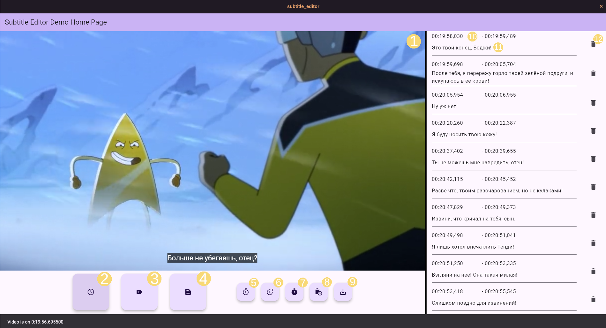

# Редактор субтитров
Кросс-платформенный редактор субтитров на Flutter, по совместительству учебный проект нашей команды:
- [lch361](https://github.com/lch361)
- [NeonNik2245](https://github.com/NeonNik2245)
- [RomanPro100](https://github.com/RomanPro100)
- [FallJock](https://github.com/FallJock)

# Особенности
- Редактирование субтитров с мгновенным предпросмотром на видеоплеере
- Импорт/экспорт субтитров в файл.
  Поддерживается формат SubRip с кодировкой UTF-8.
- Импорт видео для предпросмотра.
  Поддерживаются многие распространённые форматы видео.
- Кросс-платформенность: работает на Windows, Mac(?) и Linux

# Интерфейс



1) Видеоплеер с отображением субтитров.
2) Выводит точное текущее время видеоплеера в панели снизу, проматывает список
   субтитров на подходящую позицию.
3) Импорт видеофайла в видеоплеер.
4) Импорт списка субтитров из файла.
5) Создание нового субтитра с началом на текущей позиции и концом через несколько
   миллисекунд спустя.
6) Установка начального времени равного текущей позиции для следующего созданного субтитра.
7) Установка конечного времени и создание субтитра с предыдуще установленным начальным.
8) Удаление субтитра на текущей позиции.
9) Экспорт текущего списка субтитров.
10) Начальное и конечное время субтитра. Можно отредактировать с помощью двойного нажатия ЛКМ.
11) Текст субтитра. Можно отредактировать с помощью двойного нажатия ЛКМ.
12) Кнопка удаления субтитра.

Субтитры всегда упорядочены по времени начала, и затем по времени конца.
Несколько субтитров в одном временном промежутке отображаются на видеоплеере
одновременно.

# Горячие клавиши
- `Shift + Delete` - удалить выбранный субтитр.
- `Ctrl + Z` - отменить последнее удаление субтитра.
  Хранит историю на макс. 100 субтитров.
- Двойное нажатие ЛКМ - перемотать видео к началу субтитра.
- `Enter` - после редактирования субтитра, перемотать список на его новую позицию.

# Установка
См. [релизы](https://github.com/lch361/subtitle-editor/releases/) для
скомпилированных программ всех версий.

Пример установки и запуска для Linux, x64:
```sh
mkdir subtitle_editor
cd subtitle_editor
tar -xf subtitle_editor-linux-x64-0.1.0.tar.xz
./subtitle_editor
```

# Сборка 
1) [Установите Flutter](https://docs.flutter.dev/get-started/install) версии 3.27.1 или выше.
    - Для сборки на Linux также требуется установить пакет `libmpv-dev`.
2) Клонируйте репозиторий и перейдите в него
```sh
git clone https://github.com/lch361/subtitle-editor
cd subtitle-editor
```
3) Находясь в папке репозитория, выполните команду:
```sh
flutter build <платформа>
```
где `<платформа>` — целевая операционная система, (напр. `linux`, `windows`).
Список доступных платформ можно просмотреть командой `flutter help build`.
Путь, по которому находится скомпилированное приложение,
выведется в консоль после окончания сборки.
Программу можно уже запускать из выведенного каталога.

4) Для установки программы в свою систему, нужно установить целую папку `bundle`.
   Пример для ОС `linux`, архитектуры `x64`:
   ```sh
   sudo mv build/linux/x64/release/bundle /opt/subtitle_editor
   /opt/subtitle_editor/subtitle_editor  # Запуск программы
   ```

Более подробные инструкции по сборке читайте в [официальной документации Flutter](https://docs.flutter.dev/platform-integration/desktop).

# Лицензия
Проект использует лицензию GPL-3.0. 
